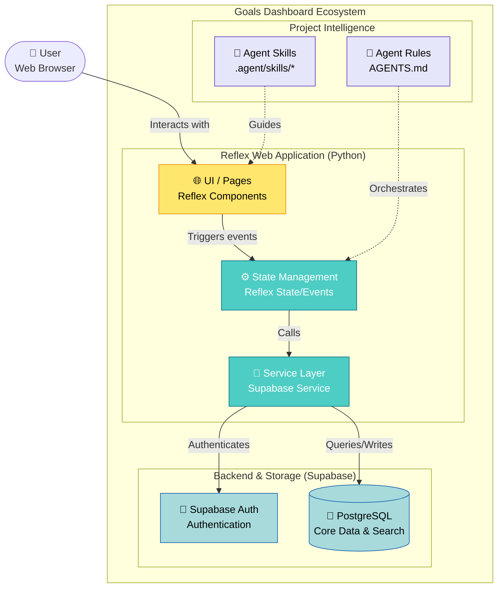

# Project Architecture: Goals Dashboard

This document describes the high-level architecture of the Goals Dashboard, a project aimed at centralizing goal tracking and task management using Reflex and Supabase.

## System Overview (C4 Container Diagram)

The following diagram illustrates the major components of the system and their interactions.

## Component Breakdown

### 1. Reflex Web Application
A unified Python framework for building full-stack web apps.
- **UI / Pages**: Declarative Python components that compile to React.
- **State Management**: Handles user sessions, global variables, and event logic.
- **Service Layer**: Abstraction for interacting with external APIs and databases.

### 2. Supabase
Backend-as-a-Service providing the database and authentication infrastructure.
- **PostgreSQL**: Stores goals, milestones, and user preferences. Supports vector search for future AI integrations.
- **Auth**: Secure user login and session management.

### 3. Agent Intelligence
A custom layer of metadata and instructions that guides the AI assistant (Antigravity) during development.
- **Skills**: Specialized knowledge bases (e.g., `mastering-git-cli`, `reflex-ui`).
- **AGENTS.md**: Orchestrates skill invocation and enforces project-specific "golden rules".
